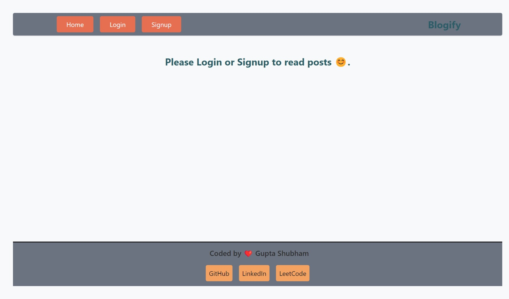
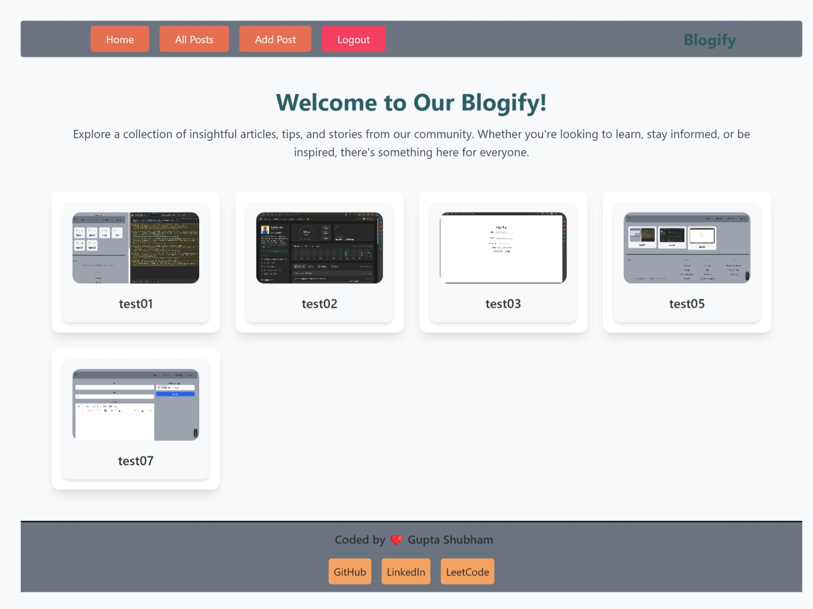
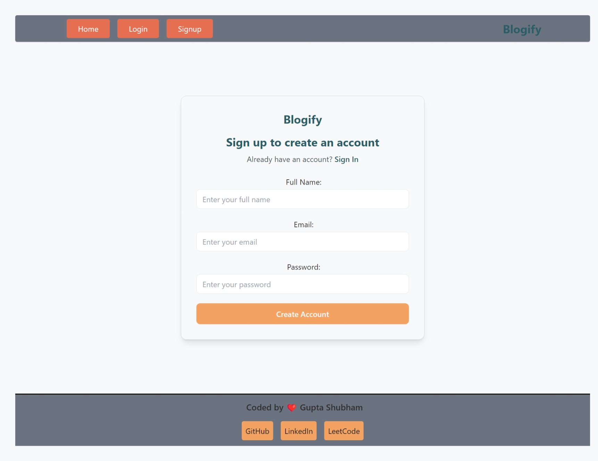
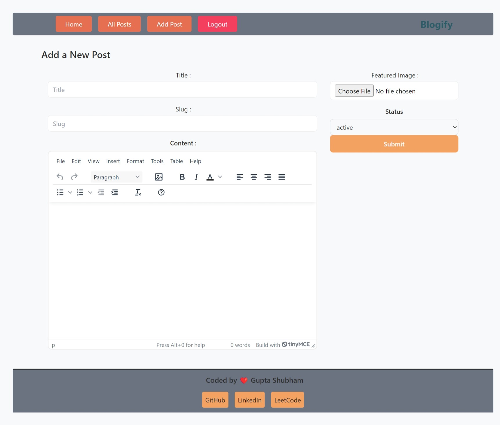
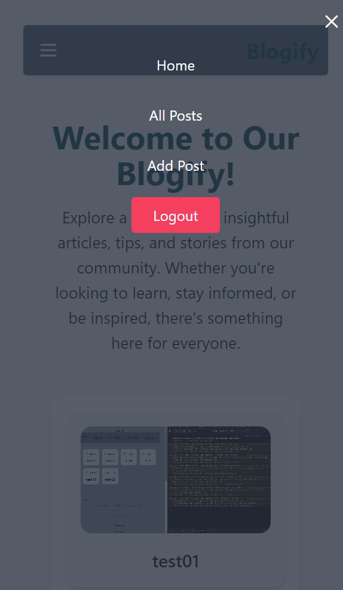

# Blogify - A Blog Application

Blogify is a simple, user-friendly blogging platform built using React and Appwrite. It allows users to create, read, update, and delete blog posts. The app features user authentication, an intuitive interface, and an easy-to-navigate design.

## Features
- **Authentication**: Login and signup with JWT-based authentication.
- **Post Management**: Users can add, edit, or delete blog posts.
- **Responsive Design**: Fully responsive UI optimized for mobile and desktop devices.
- **User Profiles**: Each user has a unique profile where they can manage their posts.
- **Post Previews**: Display featured images for blog posts.

## Screenshots

### Homepage



### Signup Page


### Add Post Page


### Mobile View (Sidebar Navigation)


## Technologies Used

- **Frontend**:
  - React
  - Tailwind CSS
  - React Router
  - Redux (for state management)

- **Backend**:
  - Appwrite (Backend-as-a-Service)
  - JWT (JSON Web Tokens) for Authentication

- **Hosting**:
  - Deployed on Vercel

## Prerequisites

Before you begin, ensure you have the following installed on your machine:
- Node.js (v14 or above)
- npm or yarn
- Appwrite account (for backend services)

## Installation

### 1. Clone the repository

```bash
git clone https://github.com/yourusername/blogify.git
```

### 2. Install dependencies

Navigate to the project directory and install the necessary dependencies.

```bash
cd blogify
npm install
```

### 3. Setup Appwrite Backend

1. Go to [Appwrite](https://appwrite.io) and create a new project.
2. Follow the [Appwrite documentation](https://appwrite.io/docs) to set up your backend (authentication, database, and storage).
3. Add your Appwrite project API keys to the `.env` file (see the `.env.example` file for configuration).

### 4. Run the App

Once everything is set up, you can run the app locally:

```bash
npm start
```

This will start the app on `http://localhost:3000`.

## File Structure

```
Directory structure:
└── guptashubham-11-blogify/
    ├── README.md
    ├── eslint.config.js
    ├── index.html
    ├── package.json
    ├── postcss.config.js
    ├── tailwind.config.js
    ├── vercel.json
    ├── vite.config.js
    ├── public/
    └── src/
        ├── App.css
        ├── App.jsx
        ├── index.css
        ├── main.jsx
        ├── appwrite/
        │   ├── auth.js
        │   └── config.js
        ├── assets/
        ├── components/
        │   ├── AuthLayout.jsx
        │   ├── Button.jsx
        │   ├── Loader.jsx
        │   ├── Login.jsx
        │   ├── Logo.jsx
        │   ├── PostCard.jsx
        │   ├── RTE.jsx
        │   ├── Select.jsx
        │   ├── Signup.jsx
        │   ├── index.js
        │   ├── Footer/
        │   │   └── Footer.jsx
        │   ├── Header/
        │   │   ├── Header.jsx
        │   │   ├── Input.jsx
        │   │   └── LogoutBtn.jsx
        │   ├── container/
        │   │   └── Container.jsx
        │   └── postForm/
        │       └── PostForm.jsx
        ├── conf/
        │   └── conf.js
        ├── pages/
        │   ├── AddPost.jsx
        │   ├── AllPosts.jsx
        │   ├── EditPost.jsx
        │   ├── Home.jsx
        │   ├── Login.jsx
        │   ├── Post.jsx
        │   └── Signup.jsx
        └── store/
            ├── authSlice.js
            └── store.js

```

## Contributing

We welcome contributions! If you want to contribute to this project, follow these steps:

1. Fork the repository.
2. Create a new branch (`git checkout -b feature-name`).
3. Make your changes and commit (`git commit -am 'Add new feature'`).
4. Push to the branch (`git push origin feature-name`).
5. Create a new Pull Request.


## Acknowledgements

- [Appwrite](https://appwrite.io) for the backend services.
- [Tailwind CSS](https://tailwindcss.com) for the styling framework.
- [React](https://reactjs.org) for the frontend framework.
